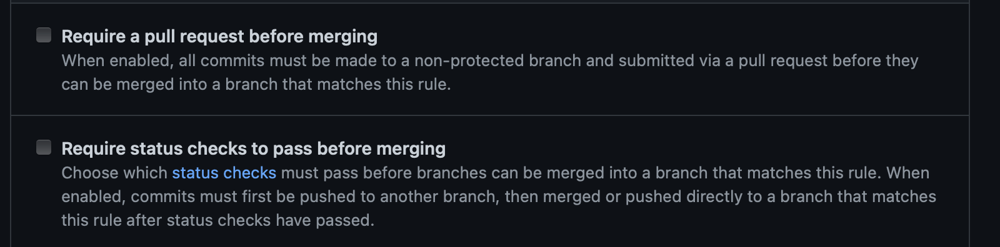
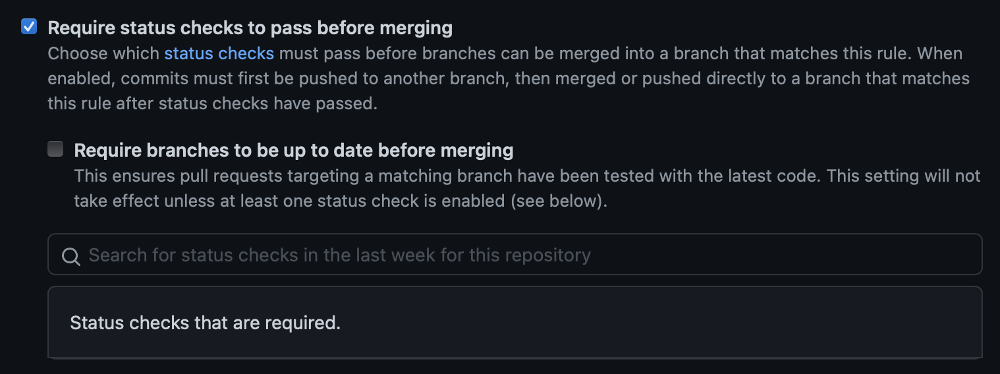
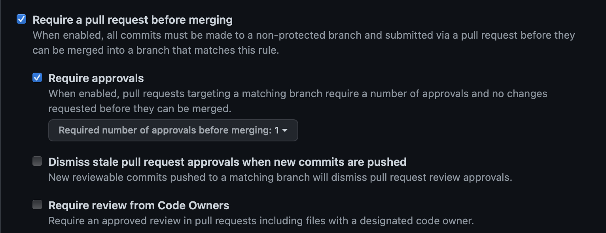

## Oppgave - DevOps

Med DevOps som arbeidsmåte i tankene- Hvilke forbedringer kan teamet gjøre med fokus på måten de jobber med kildekode og versjonskontroll?


### Drøft

* Beskriv med ord eller skjermbilder hvordan man kan konfigurere GitHub på en måte som gir bedre kontroll på utviklingsprosessen. Spesielt med tanke på å hindre kode som ikke kompilerer og feilende tester fra å bli integrert i _main_ branch.

Når du har opprettet et github repo kan du som admin gå til Settings > Branches > skriv inn navnet på den branchen du ønsker å ha regler på, eks: main > Add rule



Her finnes det flere regler du kan huke av på for å øke både kontroll og unngå å ha feilende kode i dev. Disse reglene som er i det øverste bildet er veldig greie og burde være huket av på, man burde også ta et møte med teamet sitt der man diskuterer hvilke regler som passer for dem, og hvordan man skal forholde seg til de.
I bildet under kan man spesifisere at man ønsker at koden som skal inn til main branchen skal være up to date med det som allerede er der, da unngår man også merge-conflicts.

* Beskriv med ord eller skjermbilder hvordan GitHub kan konfigureres for å sikre at minst ett annet medlem av teamet har godkjent en pull request før den merges.
Se punkt 1 på skjermbildet over, der vil det kreves en pullrequest for at man skal kunne merge kode inn i main branchen.

Her kan man definere hvor mange som skal godkjenne koden din i tillegg til andre punkter som kan være svært nyttige for team dino. Jeg ville anbefalt de å huket av på hvertfall å få to code reviews på pullrequester. Dette vil ende opp med at større deler av teamet er up to date på større deler av kode.

* Beskriv hvordan arbeidsflyten for hver enkelt utvikler bør være for å få en effektiv som mulig utviklingsprosess, spesielt hvordan hver enkelt utvikler bør jobbe med Brancher i Github hver gang han eller hun starter en ny oppgave.

Det er flere små og større grep dette teamet kan ta for å jobbe bedre, smidigere og med færre problemer. Et av de første tiltakene som burde taes er å ikke ha alle utviklere commite og pushe rett på main-branchen. I tillegg må det være flere og bedre metoder for testing. Det burde ligge egne tester for hver del av kode, både enhetstesting samt integrasjonstesting. Disse testene må kjøres i en workflow hver gang koden pushes til main/dev. Det burde bli laget en branch som kalles for dev, som skal være den branchen som hele tiden er i development. I tillegg har man en main branch som er steget før dev. Alle som skal gjøre forbedringer på koden, burde ta på seg en liten oppgave. Lage en branch med et navn som f.eks tilhører der de fordeler/velger oppgaver. Et eksempel på dette vil være om man bruker trello vil navnet på branchen kunne kobles med trello ved bruk av et navn som TC-2-oppgave2.

Deretter vil utvikleren fullføre sin lille oppgave, lage test som sjekker at den fungerer som den skal. Pushe til sin egen branch. Opprette en pull request, få et codereview fra en eller flere på teamet som har god kontroll på koden. Fikse tilbakemeldinger og forbedringer utvikleren får fra codereview. Deretter merger utvikleren selv inn til main. Når main er klar til å gå til dev merges main inn til dev.

### Drøft

SkalBank har bestemt seg for å bruke DevOps som underliggende prinsipp for all systemutvikling i banken. Er fordeling av oppgaver mellom API-teamet og "Team Dino" problematisk med dette som utgangspunkt? Hvilke prinsipper er det som ikke etterleves her? Hva er i så fall konsekvensen av dette?

I devops ser man på hvordan effektivisere arbeidsflyten. Det api-teamet og team dino gjør nå er ikke den mest effektive måten å utvikle på. 
Noen prinsipper denne arbeidsmåten bryter med devOps på er:

Her er det klart mye "waste" i kjeden. Blandt annet er det venting, hver gang team dino føler seg ferdige med å teste api'et må de vente på api-teamet.
Det å ikke ha automatiserte tester bryter med DevOps prinsipper og fører til svært tungvindte løsninger og dårlig flyt. Hvis teamet istedenfor hadde tatt i bruk single-Piece flow slik at med en gang noe var klart til å testes, selv en liten del av koden kunne team dino satt igang med det. I Tillegg kunne de tatt i bruk bedre oppgavefordelinger. Det virker som dette er veldig mange mennesker som kan svært få deler av koden og får servert noe nytt hver gang. 
Hvis teamene istedenfor hadde jobbet i mindre team som har fult og helt ansvar for deler av koden og som står for både utviklingen testingen, deploy og også det å manage koden etter den er i production ville teamene hatt mye bedre flyt samt fulgt DevOps.

### Endre applikasjonen slik at den gir fra seg telemetri

## Oppgave Terraform

### Drøft

Hvorfor funket terraformkoden i dette repoet for "Jens" første gang det ble kjørt? Og hvorfor feiler det for alle andre etterpå, inkludert Jens etter at han ryddet på disken sin og slettet _terraform.tfstate_ filen?

Denne feilmeldingen tilsier at det allerede finnes en s3 bucket med dette navnet. Hvis de ønsker å bruke dette navnet har de allerede en bucket som heter det, men siden “Jens” allerede har kjørt koden før vil jeg tippe problemet ligger i at den filen ble lagret lokalt hos Jens. Men siden Jens jobber i et team ville det vært mye lurere at den filen ble lagret remote slik som i en den bucketen som opprettes i aws.

### AWS CLI

Sensor ønsker å lage sin bucket ved hjelp av CLI. Sensor har aws kommandolinje installert på sin lokale maskin. Hva må sensor gjøre for å konfigurere AWS nøkler/Credentials? Anta at Sensor sin AWS bruker ikke har nøkler/credentials fra før.

Fullfør
```
aws s3api create-bucket --bucket pgr301-2018-terraform --region eu-west-1 --create-bucket-configuration LocationConstraint=eu-west-1
```
for å lage en bucket må du først skrive
aws configure

her må du legge inn dine nøker og region

så kan du skrive
aws s3api create-bucket --bucket pgr301-2018-terraform --region eu-west-1 --create-bucket-configuration LocationConstraint=eu-west-1


### Terraform i Pipeline

Sensor vil å lage en fork av ditt repo

* Beskriv hva sensor må gjøre etter han/hun har laget en fork for å få pipeline til å fungere for i sin AWS/gitHub konto.
* Hvilke verdier må endres i koden?
* Hvilke hemmeligheter må legges inn i repoet. Hvordan gjøres dette?

For å få sin aws konto samt github konto til å prate med pipelinen må sesnor først gå inn på sin aws konto og opprette nøkler. Dette finner sensor under sitt navn øverst i høyre hjørnet > Security credentials > Create Access Key
Her må sensor legge inn både access key og secret access key inn i github repoet. Da går sensor til repoet på github > Settings > Secrets > New Repository Secret

Der må sensor legge inn aws nøklene slik som dette:
AWS_ACCESS_KEY_ID
AWS_SECRET_ACCESS_KEY

med disse navnene.

I tillegg må sensor opprette en token i sin github konto. Dette gjøres ved at sensor trykker på navnet sitt øverst i høyre hjørnet på github > Settings > Developer Settings > Personal Access Token > og lager en token
Ta så denne tokenen og legg inn som en secret i repoet som kalles
DEVOPS

Hvis sensor lagrer secrets med disse navnene skal ikke sensor trenge å endre noe i koden. Det sensor vil kunne trenge å endre er hvis hen bruker en annen region i AWS.

### Dockerfile

Hva vil kommandolinje for å _bygge_ et container image være? Fullfør ...

```shell
docker build . --tag navnPåImaget 
```

Hva vil kommando for å _starte_ en container være? Applikasjonen skal lytte på port 7777 på din maskin. Fullfør...

```shell
docker run -p 7777:8080 navnPåImaget
```

Medlemmer av "Team Dino" har av og til behov for å kjøre to ulike versjoner av applikasjonen lokalt på maskinen sin, _samtidig_ .Hvordan kan de gjøre dette uten å få en port-konflikt?  Hvilke to kommandoer kan man kjøre for å starte samme applikasjon to ganger, hvor den ene bruker port 7777 og den andre 8888?

```shell
docker run -d -p 8888:8080 YOUR_IMAGE
```

```shell
docker run -d -p 7777:8080 YOUR_IMAGEv2
```


 


